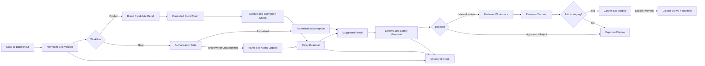

# Phase 2-5 Delivery and Evidence Report

## Delivery Status

| Area | Status | Evidence boundary |
|---|---|---|
| Product IPR review | Implemented prototype | Deterministic candidate, context, policy, and review output |
| Shop Identity | Implemented prototype | Name/avatar signals and authorization-first Gate |
| CSV/XLSX batch | Implemented | Validation, filtering, CSV and Excel export |
| Reviewer Workspace | Implemented prototype | Local JSONL persistence; Agent and Reviewer decisions remain separate |
| Golden Set staging | Implemented prototype | Candidate staging and explicit v5 JSONL promotion with SHA-256 manifest |
| Trace | Implemented prototype | Structured, persisted, recursively redacted workflow trace |
| Failure Taxonomy | Implemented | Deterministic classification and evaluation aggregation |
| Multimodal visual extraction | Partial | Existing LLM path works; new Product/Shop modules require supplied OCR/visual marks |
| Production service controls | Planned | No tenant isolation, RBAC, queue service, or production SLA |

## Updated Structure

```text
data/
  brands/controlled_brands_v1.csv
  examples/product_review_batch.csv
  examples/shop_identity_batch.csv
  reviewer/                    # ignored runtime records
  traces/                      # ignored runtime traces
  golden_set/staging/          # ignored candidates, v4 remains immutable
src/trust_safety_agent/
  brand_library.py
  product_review.py
  shop_identity.py
  batch_io.py
  reviewer_workspace.py
  staging_dataset.py
  trace.py
  trace_builders.py
  failure_taxonomy.py
```

## Main Data Models

- `ProductReviewInput` / `ProductReviewResult`: original product data,
  candidates, evidence, policy references, exemptions, suggested decision, and
  reviewer checkpoints.
- `ShopIdentityInput` / `ShopIdentityResult`: shop name, avatar, controlled
  brand, authorization status, independently inspectable signals, and result.
- `ReviewRecord`: immutable Agent fields plus separately written Reviewer and
  Final decision fields.
- `StagingGoldenCase`: reviewer-confirmed candidate data that does not mutate
  Golden Set v4.
- `ExecutionTrace` / `TraceNode`: structured workflow history with status,
  latency, optional token usage, confidence, and sanitized errors.
- `FailureType`: input, recall, retrieval, evidence, exemption, policy, schema,
  routing, confidence, and unknown failure categories.

## Workflow



## Demonstration Examples

### Product Review

Input: `Gucci` handbag with `1:1 mirror copy` text. The assistant recalls the
controlled brand, validates explicit counterfeit context, retrieves
`POL-CF-001`, and suggests `reject` with a concrete reviewer checkpoint.

### Shop Identity Batch

The example batch contains an unauthorized `Gucci Official Store`, an
authorized Nike shop, and `Apple Juice Market`. The first can reject with shop
impersonation evidence, the second passes through the authorization exemption,
and the third is treated as meaningful common-word context rather than brand
identity evidence.

### Human Review

An Agent `manual_review` result can be queued. The reviewer selects `approve`,
`reject`, or `uncertain`, adds a note, and optionally requests staging. The
record retains all three fields: Agent Decision, Reviewer Label, and Final
Decision. `uncertain` cannot enter staging.

### Trace

Product traces expose Input, Candidate Recall, Retrieval, Evidence, Exemption,
Judge, Guardrail, and Final nodes. Shop traces expose the Authorization Gate,
Shop Name Judge, Avatar Judge, Retrieval, and Final nodes. Sensitive keys and
credential-like string values are replaced by `<redacted>` before persistence.

### Evaluation

The Phase 5 rules evaluation ran against all 210 Golden Set v4 cases. It
preserved 100% auto-decision accuracy, 0% false approvals, 0% false rejections,
and 100% policy accuracy on auto-rejected cases. Coverage was 45.2% and route
accuracy was 66.7%, so the run correctly failed the production coverage and
routing gates. This is an offline-rules limitation, not a production-quality
claim. Failure aggregation identified the unresolved image path as evidence
availability failures.

## Verification

- Unit and regression suite: 99 tests passed after the final implementation pass.
- Legacy Golden smoke: 50/50 matched.
- Frozen Day 4-7 baselines verified; source-drift warnings are expected for the
  intentionally extended schema and resilient LLM compatibility facade.
- Streamlit AppTest: eight workspaces loaded with zero exceptions.
- Docker validation covers image rebuild, health status, HTTP health response,
  container-side AppTest, runtime-volume writes, and batch parsing.

## Docker

```bash
docker compose up --build -d
```

The default URL is `http://localhost:8501`. Set `APP_PORT` when that port is in
use. Chroma, reviewer records, staging candidates, and traces use separate
named volumes.

## Current Limitations

- Product and Shop modules do not independently fetch and analyze remote image
  URLs. Reliable OCR or visual marks must be supplied, otherwise the result is
  `manual_review`.
- The Controlled Brand Library and policies are synthetic demonstration data.
- JSONL persistence is suitable for a local demo, not concurrent production
  reviewers.
- v5 promotion emits an expanded JSONL candidate dataset; it is intentionally
  not substituted into the older v4 evaluator automatically.
- Failure classification is deterministic triage and still requires human
  confirmation for root-cause analysis.
- No production RBAC, tenant isolation, audit service, queue worker, or alerting
  is implemented.

## Roadmap

1. Connect Product and Shop image inputs to the existing multimodal provider and
   calibrate visual evidence on a separately labeled set.
2. Replace JSONL runtime stores with a transactional database and reviewer
   identity/audit controls.
3. Define a reviewed v5 contract and migration tool before including staging
   cases in release gates.
4. Add browser-level workflow tests for uploads, downloads, reviewer completion,
   and promotion.
5. Add a service API, authentication, rate limits, idempotency, and deployment
   observability only if the prototype moves beyond portfolio demonstration.
