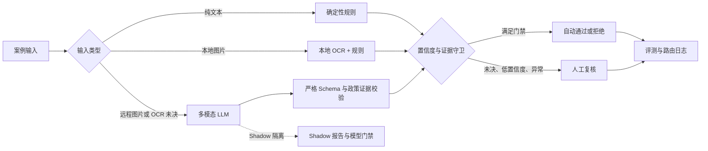

# Trust & Safety Policy Agent 项目进展与优化报告

报告日期：2026-08-27  
当前版本：Day 7 / Golden Set v4  
代码仓库：<https://github.com/TArodetalex/trust-safety-policy-agent>（Private）

## 1. 执行摘要

项目已经完成从政策知识库、确定性规则判定、多模态模型接入、生产路由、
Golden Set 治理到冻结评测基准的完整离线闭环，并已通过 Docker 方式运行。

当前最准确的阶段定位是：

> 已达到“可重复评测、可审计、可容器化演示”的生产候选原型阶段，但尚未达到
> 可直接承接真实业务流量的生产系统阶段。

现阶段的核心优势不是单一模型能力，而是安全优先的系统约束：

- 决策必须引用有效政策证据；
- 低置信度、无证据和异常输入统一转人工；
- 模型输出经过严格 JSON Schema 和本地二次校验；
- 生产路由与 Shadow 结果隔离；
- 数据、政策、配置、代码和评测结果均可通过哈希冻结；
- 离线基准保持 100% 自动判定准确率、100% 政策准确率和零误放/误拒。

当前最重要的工作不是继续优化合成数据上的规则准确率，而是补齐真实模型、
真实数据、生产服务、安全治理和持续交付能力。

## 2. 项目目标

项目目标是构建一个政策驱动的 Trust & Safety 判定系统，使每个案例能够：

1. 基于版本化政策完成通过、拒绝或人工复核判定；
2. 返回可追溯的政策标签、政策片段和推荐动作；
3. 对文本和图片输入采用不同成本与风险等级的处理路径；
4. 在不确定、无证据或组件故障时安全降级到人工复核；
5. 使用 Golden Set、blind split 和质量门禁持续评估版本变化；
6. 记录模型、Provider、延迟、tokens、费用和路由过程；
7. 通过容器部署，为后续 API 化和生产集成提供基础。

## 3. 当前系统结构

主要模块：

| 领域 | 当前实现 | 状态 |
| --- | --- | --- |
| 政策知识库 | Markdown 结构化切分、稳定 chunk ID、Chroma 检索 | 已完成 |
| 数据契约 | Pydantic 严格模型、版本化 Schema、兼容旧版本加载 | 已完成 |
| 文本判定 | 确定性规则、政策证据、置信度与人工复核 | 已完成 |
| 图片判定 | macOS Vision OCR、多模态 LLM | 部分完成 |
| 生产路由 | Rules → OCR → LLM → Human Review | 已完成 |
| LLM 协议 | 严格 JSON Schema、Provider 固定、禁止 fallback | 已完成 |
| Shadow 评测 | 全图片旁路、模型与成本遥测、独立门禁 | 代码完成 |
| 数据治理 | Golden Set v1-v4、blind split、配额与哈希清单 | 已完成 |
| 回归评测 | 指标、切片、错误桶、质量门禁、冻结基准 | 已完成 |
| 操作界面 | Streamlit 判定、检索、政策片段预览 | 已完成 |
| 容器部署 | 多阶段 Dockerfile、Compose、非 root、健康检查、持久卷 | 已完成 |
| 生产 API | 独立 HTTP API、鉴权、限流、任务队列 | 未实现 |
| 持续交付 | GitHub Actions、镜像发布、依赖与漏洞扫描 | 未实现 |

## 4. 数据与评测现状

### 4.1 数据资产

- Golden Set v4：210 条案例；
- 多模态案例：90 条；
- blind 案例：60 条；
- Day 7 新增视觉案例：60 条；
- 覆盖 5 类违规、5 类豁免、干净负向对照及低对比度、旋转、小字、遮挡；
- 图片资产通过 SHA-256 清单校验；
- 数据集、切分、标注台账和生成脚本均已版本化。

### 4.2 冻结基准

| 阶段 | 数据量 | 自动判定 | 人工复核 | 覆盖率 | 自动准确率 | 分流准确率 | 政策准确率 | 误放/误拒 |
| --- | ---: | ---: | ---: | ---: | ---: | ---: | ---: | ---: |
| Day 4 Rules | 70 | 60 | 10 | 85.7% | 100% | 100% | 100% | 0% / 0% |
| Day 5 Rules + OCR | 150 | 122 | 28 | 81.3% | 100% | 98.0% | 100% | 0% / 0% |
| Day 6 Production Offline | 150 | 122 | 28 | 81.3% | 100% | 98.0% | 100% | 0% / 0% |
| Day 7 Production Offline | 210 | 162 | 48 | 77.1% | 100% | 98.6% | 100% | 0% / 0% |

Day 7 覆盖率降低不是已知能力回退。v4 中有 45 条预期人工复核案例，理论最大
覆盖率为 78.6%，当前 77.1% 已接近数据构成允许的上限。后续不应通过降低
置信度或证据门槛来追求更高覆盖率。

### 4.3 Day 7 门禁

生产离线门禁：

- 自动判定准确率不低于 98%；
- 分流准确率不低于 95%；
- 覆盖率不低于 75%；
- 政策准确率不低于 98%；
- 误放率与误拒率必须为 0。

固定模型 Shadow 门禁：

- Schema 成功率不低于 98%；
- 决策准确率不低于 95%；
- 政策准确率不低于 98%；
- 误放率与误拒率必须为 0；
- 实际响应只能来自单一模型和单一 Provider。

## 5. 已验证的工程质量

- 67 项自动化测试通过；
- Python 编译检查通过；
- Golden Set v4 可确定性重建并通过配额、资产和哈希校验；
- Day 4-7 四个冻结基准均可验证；
- Docker 镜像构建成功；
- Compose 服务健康检查与首页均返回 HTTP 200；
- Chroma、ONNX Runtime、Streamlit 和项目包可在容器中加载；
- 容器以非 root 用户运行；
- Chroma 数据通过 Docker volume 持久化；
- Git 工作树与 `origin/main` 同步；
- 仓库中未保存 API Key。

## 6. 当前限制与风险

### 6.1 P0：上线阻断项

#### 真实固定模型 Shadow 尚未执行

当前仅完成代码和离线验证。没有使用已充值的新 Key 对固定 GPT-4o 与固定
Provider 执行 90 条图片 Shadow，因此以下指标仍未知：

- 真实 Schema 成功率；
- 模型决策与政策标签准确率；
- 真实 Provider 是否严格固定；
- p50/p95 延迟；
- 单案例 tokens 与费用；
- 网络异常、限流和超时分布。

在该报告通过 Shadow 门禁前，不应将 LLM 放入主生产路由。

#### 数据以合成案例为主

当前指标证明实现与合成政策、合成样本一致，不能直接代表真实业务精度。
真实流量中的语言变体、规避表达、图片噪声、复合违规、地区差异和政策歧义
尚未得到充分覆盖。

#### 当前政策为 mock policy

政策结构和引用机制已经建立，但生产上线前必须替换为经法务、政策和运营共同
确认的正式政策，并建立政策变更审批与回滚流程。

#### Streamlit 不是生产判定服务

当前界面适合演示和人工调试，但缺少稳定 API 契约、鉴权、租户隔离、限流、
幂等、异步任务、审计查询和服务级别目标。

### 6.2 P1：高优先级工程风险

#### Docker 与 OCR 能力不完全一致

本地 OCR 当前依赖 macOS Vision 和 Swift，仅适用于 macOS。Docker Linux
环境可以运行 Web、规则、检索和 LLM，但不能复用该本地 OCR 路径。应实现
Linux OCR Provider，或将 OCR 独立为受版本控制的外部服务。

#### 缺少 CI/CD

当前测试、基准验证和 Docker 构建依赖手工执行。没有 GitHub Actions、分支
保护、镜像签名、依赖漏洞扫描和自动发布流程。

#### 依赖未完全锁定

`pyproject.toml` 使用版本区间，镜像在不同时间可能解析出不同传递依赖。
需要生成跨平台锁文件，并对基础镜像使用固定 digest 或自动化升级流程。

#### 可观测性仅停留在评测文件

已有评测与路由记录，但缺少在线指标、结构化日志、trace、告警和仪表盘。
生产环境需要追踪流量、路由、人工复核率、错误率、延迟、费用和政策分布。

#### 安全与隐私治理不足

需要明确图片和文本的保存期限、脱敏策略、第三方模型数据使用条款、访问控制、
审计记录和删除机制。上传大小、文件类型、恶意文件及 Prompt Injection 也需
独立防护。

### 6.3 P2：体验与扩展性

- Web 界面尚未暴露完整生产路由和每一步路由解释；
- 缺少批量案例上传、任务进度、失败重试和结果导出；
- 缺少政策版本对比、回归差异和 bad-case 管理界面；
- 缺少人工复核反馈回流和标注一致性统计；
- 尚未验证 amd64 镜像、云环境持久卷和反向代理部署。

## 7. 优化优先级

| 优先级 | 工作项 | 目标 | 验收标准 |
| --- | --- | --- | --- |
| P0 | 固定 GPT-4o Shadow | 获得真实模型质量、延迟与成本 | 90 张图片全部执行，双门禁通过，模型与 Provider 唯一 |
| P0 | 真实 blind 数据集 | 验证泛化能力 | 独立抽样、双人标注、仲裁完成，生产逻辑不可读取真值 |
| P0 | 正式政策接入 | 替换 mock policy | 政策 owner 签字、版本号、变更记录、回滚测试齐全 |
| P0 | 服务化 API | 支持系统集成 | OpenAPI 契约、鉴权、幂等、超时、错误码和审计日志 |
| P1 | Linux OCR | 补齐容器图片离线能力 | 固定 OCR 版本，置信度可校准，v4 回归门禁通过 |
| P1 | CI/CD | 自动阻止回归 | PR 自动执行测试、基准、数据校验、镜像构建和安全扫描 |
| P1 | 依赖锁定 | 保证可重复构建 | 锁文件、镜像 digest、SBOM 和依赖升级流程 |
| P1 | 在线可观测性 | 支持运营与故障定位 | 指标、日志、trace、告警和成本仪表盘可用 |
| P1 | 隐私与安全 | 满足真实数据要求 | 数据分类、保存期限、加密、访问审计和删除流程 |
| P2 | 复核工作台 | 提升人工效率 | 队列、筛选、批量操作、证据展示和反馈回流 |

## 8. 建议实施路线

### 阶段 A：远程模型闭环

预计 1 周。

1. 创建专用、限额、可轮换的模型 Key；
2. 固定 `openai/gpt-4o` 与 OpenAI Provider；
3. 执行 90 条图片 Shadow；
4. 冻结 `shadow_report.json` 和完整运行元数据；
5. 按错误桶分析 Schema、政策、决策、延迟和成本；
6. 未通过门禁时保持 LLM 仅 Shadow，不修改生产路由。

### 阶段 B：工程化与持续交付

预计 1-2 周。

1. 增加 GitHub Actions；
2. 锁定 Python 依赖和基础镜像；
3. 自动执行 67 项测试、四个冻结基准和 Golden Set 校验；
4. 构建 amd64/arm64 镜像并推送 GitHub Container Registry；
5. 增加镜像漏洞扫描、SBOM 和发布标签；
6. 设置 `main` 分支保护和必需检查。

### 阶段 C：生产服务化

预计 2-4 周。

1. 将核心判定能力封装为 FastAPI 服务；
2. 保留 Streamlit 作为内部调试和运营界面；
3. 增加鉴权、请求 ID、幂等键、限流和超时；
4. 对图片任务采用对象存储与异步队列；
5. 增加结构化审计日志、Prometheus 指标和 tracing；
6. 为政策、模型和路由配置提供独立版本号。

### 阶段 D：真实业务试点

预计 2-4 周，取决于数据获取和合规审批。

1. 建立脱敏真实样本池和独立 blind split；
2. 执行双人标注和争议仲裁；
3. 对规则、OCR、固定模型和组合路由进行对比；
4. 先运行 Shadow，再运行低比例 canary；
5. 按政策类别设置独立门禁，不只观察总体平均值；
6. 出现误放或误拒时自动回退到人工复核。

## 9. 建议新增指标

离线质量：

- 各政策类别 precision、recall 和 F1；
- blind、图片难度、语言、内容类型和来源切片；
- 置信度校准误差；
- 人工复核召回率；
- 新旧政策版本决策差异率。

在线可靠性：

- 请求成功率和各错误码比例；
- p50、p95、p99 总延迟及分阶段延迟；
- OCR、LLM 和人工复核路由比例；
- Provider 超时、限流和非法响应率；
- 每案例 tokens、费用和日预算消耗。

运营指标：

- 人工复核队列长度和处理时长；
- reviewer 一致率与仲裁率；
- 政策类别趋势；
- 自动判定撤销率；
- bad-case 修复周期。

## 10. 近期可执行清单

建议按以下顺序推进：

1. 获取新的限额 API Key，完成固定模型 Shadow；
2. 生成 Shadow 错误分析和模型成本报告；
3. 增加 GitHub Actions 与分支保护；
4. 锁定依赖并发布首个版本标签；
5. 构建并验证 amd64/arm64 镜像；
6. 实现 Linux OCR Provider 或独立 OCR 服务；
7. 增加 FastAPI 判定接口与 OpenAPI 契约；
8. 增加鉴权、审计、限流和隐私策略；
9. 建立真实 blind 数据集和标注仲裁流程；
10. 完成 Shadow → canary → 正式路由的发布方案。

## 11. 发布决策原则

- 不以降低置信度、证据或政策校验门槛换取覆盖率；
- 不用总体准确率掩盖高风险政策切片；
- 不将合成数据结果等同于真实业务表现；
- 不允许模型输出绕过本地 Schema 和证据校验；
- 不允许 Shadow 结果影响生产决策；
- 未通过 blind 与零误放/误拒门禁时，不进入自动化主路由；
- 任何组件失败时优先转人工，而不是静默放行。

## 12. 总结

项目已经建立了扎实的离线评测和安全路由基础，数据版本、政策证据、质量门禁、
Shadow 隔离与冻结基准均具备继续演进的条件。当前瓶颈已经从“功能是否存在”
转向“真实环境是否有效、是否可运营、是否可治理”。

下一阶段应以固定模型 Shadow 和真实 blind 数据为质量主线，以 API、CI/CD、
可观测性和安全治理为工程主线。只有两条主线同时完成，项目才适合从演示和
离线验证阶段进入受控业务试点。
